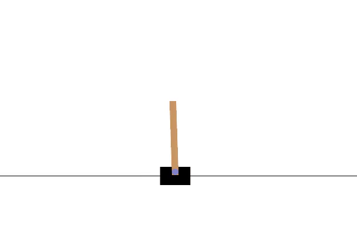

# PPO Agent on CartPole-v1 (Colab Notebook)

This Jupyter Notebook offers a complete, beginner-friendly walkthrough of training a reinforcement learning agent using the Proximal Policy Optimization (PPO) algorithm in PyTorch. It demonstrates how an agent can learn to solve the classic CartPole-v1 environment from the Gym library. The notebook not only includes the full training pipeline but also renders the agent’s performance and displays it as an animated video, making it easy to understand and visualize the results—even for those new to reinforcement learning.

## 📌 Features

- PPO implementation with Actor-Critic architecture
- Single notebook (no external files)
- Uses latest Gym API (separates `terminated` and `truncated`)
- Video rendering and display inside the notebook using `imageio` and Colab

## 🧪 Dependencies

Make sure to install the following libraries inside your Colab notebook:

```python
!pip install gym==0.26.2 matplotlib imageio torch numpy==1.23.5
````

## 🚀 How to Use

Just run the notebook cells in order. It will:

1. Define the PPO agent and buffer
2. Train the agent for `N` episodes
3. Record the trained agent's behavior
4. Save the frames to an `.mp4` video
5. Show the video inline in the notebook
## 🎞️ Demo



## 🎥 Video Output (Displayed in Notebook)

At the end of training, the notebook records the agent playing an episode and generates a video like this:

```python
import imageio
from IPython.display import HTML
from base64 import b64encode


imageio.mimsave("cartpole.mp4", frames, fps=30)


mp4 = open("cartpole.mp4", 'rb').read()
data_url = "data:video/mp4;base64," + b64encode(mp4).decode()
HTML(f'<video width=400 controls><source src="{data_url}" type="video/mp4"></video>')
```

No need to download anything — the video plays right in the notebook!

## ✅ Notes

* Make sure you're using Gym >= 0.26+ (which uses the new step API).
* Designed for Google Colab with automatic rendering and playback.

## 📜 License

MIT License. Free to use and modify.

